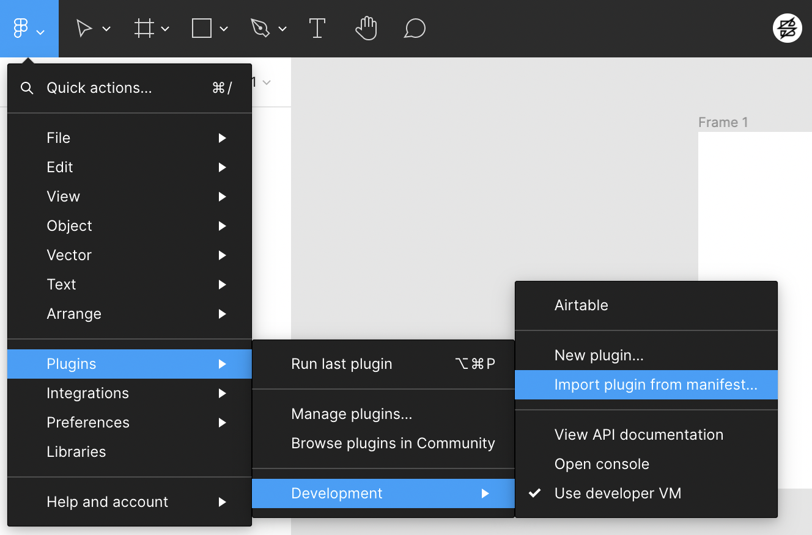

# Airtable Data to Figma Styles

This is a Figma plugin that will take data from an Airtable table and create color styles in your Figma file. 

## Using in Figma

1. To get started with this plugin, download this repo and save it wherever you'd like on your computer.

2. You'll have to get the plugin connected to your Airtable account. For this you'll need to create a `.env` file (you can look at the .env.example file in the repo) and reference your Airtable API key. 

3. You'll then need to make sure that you are referencing the correct Airtable base and table. To do that, you will need to edit `src/records.airtable`. Here you will edit the baseId and tableName of the Airtable you would like to pull from. In order for this to work without editing further code, you will need to leave the fields alone and make sure your table contains those columns. You can view an example Airtable with the proper setup here (https://airtable.com/shrr0b5FUJzBToRON/tblAacn6iRF3PYibR).

4. Once everything has been added, open your Figma file an go to Plugins > Development > Import plugin from manifest.. 

5. Navigate to where you saved this repo and select the `manifest.json` file in the root of the project. This will add it to your list of plugins.

6. To run the plugin, go to Plugins > Development and click on "Airtable" which should now be at the top of the Development menu. You should see the color styles populate in your Figma file after a second.

## Additional Helpful Links

- Figma Plugin Documentation: https://www.figma.com/plugin-docs/setup/
- Airtable API Documentation: https://airtable.com/appblz15LnTqipptS/api/docs#javascript/introduction
- Discussion Board on connecting to Airtable API: https://community.airtable.com/t/help-connecting-to-airtable-api-to-make-a-basic-console-log-output/33730/4
- Creating a Figma Style progammatically: https://forum.figma.com/t/dynamically-create-palette-with-createpaintstyle-locked-on-hextorgba-javascipt-function/5367
- New airtable-loader npm module: https://www.npmjs.com/package/airtable-loader

## Log
- Initially imported Airtable from node modules to run code, but I got a "process not defined" error SO
- I switched to use the airtable.browser.js version, but Figma was not happy with "import" or "require" from separate files since it only wants a single JS file, SO
- I followed the Figma documentation to add Webpack to the project to compile Airtable and my Typescript code into a single file, but Figma did not like the way Airtable was being added and was giving me a "not a constructor" error for creating a new Airtable, SO
- We tried creating a vanilla.js file and embedded the airtable.browser.js inside rather than importing. This fixed the constructor error but broke all of the imports inside the airtable.browser.js code, SO 
- I found a brand new npm package (https://www.npmjs.com/package/airtable-loader) that connects to Airtable and packages the data for use in JavaScript and it works!
- Slight problem though, this only runs when webpack builds, so if any updates are made to the Airtable, they would not be pulled in. 
- So I found out that you can add a `build` attribute to the `manifest.json` where you can tell it to do something before the plugin runs. I added code to build the app through Webpack and it now grabs the updated data and then runs!
